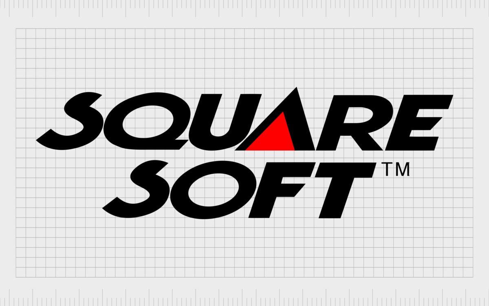

## The Chronicle of Square Enix: A Saga of Pixels, Power, and Persistence

Square Enix stands as a titan in the video game industry, a name synonymous with epic role-playing games, iconic characters, and a history as dramatic and complex as any of its beloved narratives. Born from the ambitious merger of two Japanese gaming giants, Square Co., Ltd. and Enix Corporation, its journey is one of groundbreaking innovation, daring risks, devastating crises, and remarkable resilience. This deep dive explores the pivotal moments, strategic decisions, and lesser-known events that forged the identity of Square Enix.

---

### The Two Pillars: The Birth of Square and Enix

Long before they became one, Square and Enix carved out distinct, powerful legacies in the nascent Japanese video game market.

#### Square Co., Ltd.: A Vision for Collaborative Creation

_Early Square Logo_

Founded in September 1983 as a computer game software division of Den-Yu-Sha, an electrical power construction company owned by Kuniichi Miyamoto, **Square Co., Ltd.** was the brainchild of his son, **Masafumi Miyamoto**. Uninterested in the family's primary business, Masafumi envisioned a new way to create video games. At a time when many Japanese games were developed by solo programmers, Miyamoto championed a collaborative, team-based approach, bringing together specialized graphic designers, programmers, and story writers. This philosophy was embedded in the company's name, "Square," referencing both a "town square" for cooperative creation and a golfing term for confronting challenges directly.

Early hires included future luminaries like **Hironobu Sakaguchi** and Hiromichi Tanaka. Square initially focused on PC titles like _The Death Trap_ (1984). However, after becoming an independent company in September 1986, Square faced severe financial difficulties following a string of commercial failures on Nintendo's Famicom Disk System.

On the brink of bankruptcy, Hironobu Sakaguchi was given a last chance to create a passion project. Inspired by Enix's runaway hit _Dragon Quest_, he conceived a role-playing game. Believing it might be his final contribution to gaming, he aptly named it **Final Fantasy** (1987).

_(Image: Final Fantasy I Box Art or Title Screen)_

The game was a monumental success, saving Square from financial ruin and establishing its flagship franchise. _Final Fantasy_ became synonymous with deep storytelling, evolving gameplay systems, and memorable scores by Nobuo Uematsu. This success allowed Square to further develop other notable series like the experimental _SaGa_ (created by Akitoshi Kawazu, starting with _The Final Fantasy Legend_ in 1989) and the whimsical _Mana_ series (created by Koichi Ishii, starting with _Final Fantasy Adventure_ in 1991). Square quickly became renowned as a premier developer of high-quality RPGs.

#### Enix Corporation: Publishing Prowess and a Quest for Dragons

_(Image: Early Enix Logo - Example: Script 'e' with ENIX below)_

**Enix Corporation** was founded on September 22, 1975, by architect-turned-entrepreneur **Yasuhiro Fukushima** as Eidansha Boshu Service Center, initially a publisher of real estate advertising tabloids. In 1982, following an unsuccessful attempt to build a nationwide chain, Fukushima astutely pivoted towards the burgeoning video game market, renaming the company Enix – a portmanteau of "Phoenix" (symbolizing rebirth) and "ENIAC" (one of the first electronic computers).

Rather than building large internal development teams, Enix adopted an innovative publishing model. To unearth talent, Enix launched the **"Enix Game Hobby Program Contest"** in 1982, advertised in computer and manga magazines, offering a ¥1 million prize. This contest was pivotal, discovering talents like **Yuji Horii** (who submitted a tennis game) and Koichi Nakamura (_Door Door_).

This unique approach shaped Enix's identity: a publisher that curated and brought diverse, externally developed creations to market, paying royalties – a novel practice at the time that controlled costs.

The most significant fruit of this model was **Dragon Quest** (1986). Developed by Chunsoft (founded by Koichi Nakamura), with a scenario by Yuji Horii, character designs by the famed _Dragon Ball_ artist **Akira Toriyama**, and an iconic score by **Koichi Sugiyama**, _Dragon Quest_ became a cultural phenomenon in Japan. Its charming world, accessible gameplay, and epic narrative captivated millions, establishing Enix as a dominant force in the RPG market and providing a stable financial pillar.

_(Image: Dragon Quest I (Famicom) Box Art or Title Screen)_

Enix's publishing acumen extended beyond _Dragon Quest_. They brought forth other critically acclaimed series by partnering with talented studios like Quintet (responsible for classics like _ActRaiser_, _Soul Blazer_, and _Terranigma_) and tri-Ace (_Star Ocean_, _Valkyrie Profile_). This diverse portfolio showcased Enix's ability to identify and market quality titles from various creators.

A crucial, and lesser-known, strategic decision was Enix's early adoption of a multiplatform stance. In January 1997, while Square was deeply committed to Sony's PlayStation, Enix announced it would release games for both Nintendo and Sony consoles, a move that showcased foresight and financial pragmatism.

Furthermore, Enix diversified its business significantly with the launch of **Monthly Shonen Gangan** in March 1991. This manga magazine became a major success, publishing enduring hits like _Fullmetal Alchemist_ and _Soul Eater_, providing Enix with a substantial secondary revenue stream and cross-media opportunities.

---

### The Road to Union: Ambition, Crisis, and a Landmark Merger

As the 1990s progressed, Square reached new heights of global acclaim, particularly with its move to the Sony PlayStation.

#### Square's Golden Age on PlayStation

The decision to develop **Final Fantasy VII** (1997) for the PlayStation, due to the console's CD-ROM storage capacity (which was essential for the game's ambitious pre-rendered backgrounds and CGI cinematics), was a seismic shift. While it strained relations with Nintendo, _Final Fantasy VII_ became a colossal global success, selling millions of copies and popularizing JRPGs in the West on an unprecedented scale. It cemented Square's reputation for cinematic, emotionally resonant experiences.

_(Image: Final Fantasy VII artwork or iconic scene like the opening shot of Midgar)_

This era saw Square release a string of beloved classics, including _Parasite Eve_, _Xenogears_, _Chrono Cross_, and _Vagrant Story_, showcasing remarkable creative output.

#### Crisis at Square: _Final Fantasy: The Spirits Within_

However, Square's ambition led to a monumental crisis. Hironobu Sakaguchi spearheaded the creation of Square Pictures in Hawaii, aiming to produce a groundbreaking CGI film, **Final Fantasy: The Spirits Within** (2001). The film, while visually stunning for its time, was a box office disaster. Budgeted at an estimated $137 million, it grossed only $85 million worldwide, leading to massive financial losses for Square and the closure of Square Pictures.

_(Image: The Spirits Within poster or still)_

The failure of _The Spirits Within_ put Square in a precarious financial position, despite the ongoing success of its games like _Final Fantasy X_ and the newly launched _Kingdom Hearts_ (a successful collaboration with Disney). This crisis accelerated discussions for a long-considered merger with Enix.

#### The Merger: Square Enix is Born (2003)

On **April 1, 2003**, Square Co., Ltd. and Enix Corporation officially merged to form **Square Enix Co., Ltd.** Enix was the surviving legal entity, but the new company aimed to leverage the strengths of both.

- **Motivations:**
  - **Rising Development Costs:** The increasing complexity and cost of game development for newer consoles.
  - **Intensifying Market Competition:** Both domestically and from burgeoning Western developers.
  - **Synergies:** Square brought its powerful internal development studios, globally recognized IP like _Final Fantasy_, and a strong international presence. Enix contributed its flagship _Dragon Quest_ IP, strong Japanese market understanding, publishing expertise, a stable financial base (having never posted a loss since its 1991 listing), and valuable manga business.
  - **Yoichi Wada's Vision:** Then-president of Square, Yoichi Wada (who became president of the new entity), had reportedly envisioned industry consolidation since 2000 and saw the merger as an "offensive" move to increase development power, earnings, and global competitiveness.

Enix founder Yasuhiro Fukushima became Chairman of Square Enix. The merger was a landmark event, creating a Japanese publishing giant with an unparalleled portfolio of RPG franchises.

_(Image: Square Enix First Logo)_

---

### Navigating a New Era: Square Enix Post-Merger

The newly formed Square Enix faced the challenge of integrating two distinct corporate cultures and development philosophies. The legacy of Square's robust internal teams and Enix's publisher-centric, often outsourced model, needed to find a new equilibrium.

#### Major Turning Points & Strategic Decisions:

- **Continued Success of Flagship Franchises:** _Final Fantasy_ and _Dragon Quest_ continued to be pillars of the company, with numerous sequels, spin-offs, remakes, and remasters sustaining their popularity.

- **Embracing Online: _Final Fantasy XI_ and the _FFXIV_ Saga:**
  Square had already ventured into the MMORPG market with _Final Fantasy XI_ (2002), which found sustained success. Square Enix continued this with _Dragon Quest X_ (primarily in Japan) and, most notably, _Final Fantasy XIV_.
  The initial launch of **Final Fantasy XIV (1.0)** in 2010 was a critical and commercial disaster. The game was plagued with issues, damaging the company's reputation. In an unprecedented move, Square Enix apologized, replaced the development team, and appointed **Naoki Yoshida** as Producer and Director. Yoshida and his team made the bold decision to rebuild the game from scratch while maintaining the original version.
  **Final Fantasy XIV: A Realm Reborn** launched in 2013 to widespread acclaim, turning one of the industry's biggest failures into one of its most successful and beloved MMORPGs – a testament to listening to feedback and a willingness to invest heavily in correction. This remains a major profit driver.

  _(Image: FFXIV A Realm Reborn artwork)_

- **Diversification and Expansion:**

  - **Taito Corporation (2005):** Square Enix acquired Taito, known for arcade classics like _Space Invaders_ and a significant arcade operation business in Japan. This move aimed to diversify revenue streams, gain access to new IPs, and secure a stable cash flow business to complement the hit-driven console market.
  - **Eidos Interactive (2009):** In a major push for Western market penetration, Square Enix acquired British publisher Eidos, gaining iconic IPs like _Tomb Raider_, _Deus Ex_, _Thief_, and _Hitman_ (though Hitman IP later reverted to IO Interactive). This significantly expanded its global development capabilities and IP portfolio. However, in May 2022, Square Enix sold Crystal Dynamics, Eidos-Montréal, and Square Enix Montréal, along with their associated IPs including _Tomb Raider_ and _Deus Ex_, to Embracer Group. This decision was framed as a move to allow more focused investment in its core Japanese studios and IPs, and to explore new business models including blockchain and AI, though it also followed reports of disappointment with the sales of some Western-developed titles.
  - **Mobile Gaming:** Square Enix has been active in mobile gaming for many years, releasing ports of classic titles, spin-offs, and original mobile-first games like _Kingdom Hearts Missing-Link_. While some titles have been very successful, the mobile division has also faced challenges, including game closures and declining profits in recent years, leading to strategy revisions.

- **New IP Development:**
  Alongside its established franchises, Square Enix has continued to invest in new IPs with varying degrees of success. Notable examples include the action-RPG _Nier_ (especially the breakout hit _NieR:Automata_), the _Bravely Default_ series, and _The World Ends with You_.
  A significant internal innovation has been the **HD-2D** visual style, pioneered by Producer Tomoya Asano and his team (often referred to as "Team Asano"). Starting with _Octopath Traveler_ (2018), this blend of 2D pixel art with 3D environments and modern effects has been critically and commercially successful, used for new IPs like _Triangle Strategy_ and highly anticipated remakes such as _Live A Live_ and _Dragon Quest III HD-2D Remake_.

  _(Image: Octopath Traveler screenshot)_

- **Embracing Multiplatform: A Recent Strategic Overhaul:**
  While historically having periods of PlayStation exclusivity for major _Final Fantasy_ titles, Square Enix in 2024-2025, under CEO Takashi Kiryu, announced a major strategic shift. This involves "aggressively pursuing a multiplatform strategy" for its HD titles, including major franchises, across Nintendo platforms, PlayStation, Xbox, and PC. This is driven by the desire to maximize audience reach, recoup rising development costs, and a response to some recent high-profile titles reportedly not meeting the higher end of sales expectations. This is part of a broader "three-year reboot" focusing on "quality over quantity" and restructuring internal development.

#### Overcoming Adversity:

Beyond the _FFXIV 1.0_ crisis, Square Enix has navigated other challenges:

- **Managing Critical Backlash:** _Final Fantasy XIII_ (2009) faced criticism for its linearity. Square Enix responded by developing two sequels (_XIII-2_ and _Lightning Returns_) that addressed some concerns by offering more player agency and exploration. _Final Fantasy XV_ (2016), after a protracted development, received mixed reactions regarding its story and structure; the company supported it extensively post-launch with updates and DLC to refine the experience.
- **Fallout with Nintendo:** Square's move to PlayStation in the mid-90s created a long rift with Nintendo. This was gradually mended over many years, with Square Enix eventually becoming a strong third-party supporter, exemplified by titles like _Dragon Quest IX_ on the DS and the current multiplatform push.
- **Addressing Recent AAA Underperformance and Market Shifts:** The recent strategic shift to multiplatform development, a "quality over quantity" approach, and internal restructuring (including significant "content abandonment" write-offs for unannounced projects) is a direct response to some major titles not meeting highest sales expectations and challenges in the mobile sector. This indicates an ongoing process of adaptation to a rapidly changing global market.
- **Loss of Key Talent:**
  - **Hironobu Sakaguchi's** departure around 2003 after _The Spirits Within_ was a significant loss. Square Enix adapted with remaining talent like Yoshinori Kitase taking on larger roles.
  - **Yasumi Matsuno** (creator of _Final Fantasy Tactics_, _Vagrant Story_) left during the development of _Final Fantasy XII_ (c. 2005). The game was completed by the team and was still a success, though his departure was felt by fans of his unique style.
  - Enix faced a notable crisis in its **Gangan Comics** division in the early 2000s when a number of editors and artists left due to creative disagreements, forming the rival Mag Garden. Enix partially resolved this through an investment in Mag Garden, and Gangan's fortunes were significantly boosted by the success of _Fullmetal Alchemist_.

---

### The Unseen Architects: Lesser-Known Pivotal Events Shaping Identity

Beyond the headline news, several less-publicized factors have profoundly shaped Square Enix:

- **Foundational DNA:**
  - **Masafumi Miyamoto's Team-Based Philosophy (Square):** His early insistence on collaborative teams with specialized roles was crucial for developing complex RPGs and became a cornerstone of Square's development culture.
  - **Enix's Game Contest Model:** This innovative approach shaped Enix's identity as a publisher skilled at identifying and nurturing external talent and IP, fostering a diverse early portfolio.
  - **Enix's Publishing Partnerships:** The relationships with studios like Chunsoft, Quintet, and tri-Ace were vital for Enix, allowing them to bring a variety of high-quality RPGs to market and demonstrating their acumen in managing external development.
- **The Power of Internal Innovation and Vision:**
  - **Visual Works:** Square's internal CGI studio, Visual Works, has been instrumental in defining the cinematic quality of _Final Fantasy_ and other titles since _FFVII_. Even if _The Spirits Within_ (by the separate Square Pictures Hawaii) failed, the ambition it represented likely fueled the continued excellence and importance of in-game cinematics produced by Visual Works.
  - **Square's Experimental RPGs:** Titles like the _SaGa_ series, _Parasite Eve_, _Vagrant Story_, _Xenogears_, and _Live A Live_ allowed for creative risk-taking, cultivated talent, explored niche themes, and built Square's reputation for innovation beyond mainline _Final Fantasy_ games.
  - **Koichi Ishii's Influence:** Creator of the _Mana_ series and the iconic Chocobo and Moogle characters, Ishii's distinct artistic and gameplay vision provided an important alternative style within Square's portfolio and left an indelible mark on _Final Fantasy_ itself.
  - **The HD-2D Engine/Style (Team Asano):** This internally developed visual style has become a significant success, demonstrating how focused teams within the larger company can create impactful and commercially viable innovations.
- **Strategic Foresight and Structure:**
  - **Enix's Early Multiplatform Stance (1997):** This showed adaptability and likely contributed to Enix's stability, making it an attractive merger partner.
  - **Yoichi Wada's Long-Term Vision:** His foresight regarding industry consolidation and the shift towards online gaming influenced Square Enix's proactive strategies in mergers, MMORPGs, and digital diversification.
  - **Business Division/Creative Business Unit Structure:** For many years, Square Enix organized its development teams into units responsible for specific franchises. While this may have fostered focus, the recent (2024-2025) decision to dismantle this for a more "operationally integrated organization" is a pivotal internal shift aimed at improving efficiency, synergy, and adapting to new development realities. This acknowledges that the old structure, while long-standing, may have had limitations.
  - **The "Publisher vs. Developer" DNA:** The merger combined Enix's publishing and outsourcing strengths with Square's deep internal development talent. The ongoing balance and evolution of this combined DNA continue to shape Square Enix's approach to game creation and partnerships.

---

### Conclusion: The Enduring Legacy and Future of Square Enix

Square Enix's history is a testament to its ability to innovate, adapt, and endure. From the brink of bankruptcy that birthed _Final Fantasy_ to the groundbreaking merger that reshaped its future, from the ambitious highs of _Final Fantasy VII_ to the humbling failure of _The Spirits Within_ and the stunning rebirth of _Final Fantasy XIV_, the company has consistently navigated the turbulent waters of the video game industry.

Its identity has been forged by:

- **Iconic Intellectual Properties:** _Final Fantasy_ and _Dragon Quest_ remain global cultural touchstones, continually reinvented for new generations.
- **A Commitment to Storytelling and Cinematic Presentation:** Elevating narrative and visual artistry in RPGs.
- **Innovation in Gameplay:** Constantly evolving core series and experimenting with new mechanics and genres.
- **Resilience in Crisis:** Demonstrating an ability to learn from failures and make bold corrective actions.
- **A Blend of Creative Vision and Business Acumen:** Balancing the ambitious dreams of its creators with the pragmatic realities of the market.

Today, Square Enix faces new challenges: the ever-increasing costs of AAA development, a fiercely competitive global market, evolving player expectations, and the need to consistently deliver "fun" that resonates worldwide. Its current strategic overhaul – emphasizing multiplatform releases, focusing on quality over quantity, and reorganizing its internal development structures – reflects a company once again adapting to a changing landscape.

The chronicle of Square Enix is far from over. With a rich legacy of beloved worlds and characters, and a renewed focus on its creative core, the company continues its quest to shape the future of interactive entertainment, one epic adventure at a time.
